# MooviBooki Backend Architecture & Design Document

## Table of Contents

1. [Overview](#overview)
2. [Technology Stack](#technology-stack)
3. [Layered Architecture](#layered-architecture)
4. [Core Modules & Responsibilities](#core-modules--responsibilities)
5. [Domain Model & Entity Relationships](#domain-model--entity-relationships)
6. [Security & Authentication](#security--authentication)
7. [Caching & Distributed Locking](#caching--distributed-locking)
8. [External Integrations](#external-integrations)
9. [Exception Handling](#exception-handling)
10. [Configuration & Environment](#configuration--environment)
11. [API Design & Extensibility](#api-design--extensibility)

---

## Overview

The backend of MooviBooki is a robust, concurrent, and scalable movie booking system built with Spring Boot. It supports user registration, authentication, movie and theater management, seat booking with distributed locking, payment processing, and analytics. The system is designed for high concurrency, data consistency, and security.

## Technology Stack

- **Language:** Java 17+
- **Framework:** Spring Boot
- **Database:** PostgreSQL
- **Cache/Locking:** Redis (via Redisson)
- **Email:** SMTP (Spring Mail, Thymeleaf templates)
- **Image Upload:** Cloudinary
- **API Docs:** Swagger/OpenAPI
- **Build Tool:** Maven

## Layered Architecture

- **Controller Layer:** REST endpoints for all features, input validation, and security annotations.
- **Service Layer:** Business logic, transaction management, distributed locking, and orchestration of external services.
- **Repository Layer:** Spring Data JPA repositories for all entities.
- **Model Layer:** JPA entities, DTOs for requests/responses, enums for domain concepts.
- **Utility Layer:** JWT utilities, entity-DTO mappers, etc.
- **Configuration Layer:** Security, cache, Redisson, Swagger, and email configs.

## Core Modules & Responsibilities

### 1. **User Management**

- Registration, login, email verification, password reset, profile management.
- Role-based access (USER, ADMIN, THEATER_OWNER).
- JWT-based authentication and token blacklisting.

### 2. **Movie Management**

- CRUD for movies, poster upload, reviews.
- Search and filter movies by genre, language, etc.

### 3. **Theater & Screen Management**

- CRUD for theaters and screens.
- Amenities, logo upload, and screen layouts.

### 4. **Booking & Seat Selection**

- Book, modify, cancel, and group bookings.
- Seat locking with distributed locks to prevent double-booking.
- Booking history and analytics.

### 5. **Payment Processing**

- Payment entity linked to bookings.
- Supports multiple payment methods (CARD, UPI, WALLET).
- Payment status tracking.

### 6. **Promo Codes**

- Apply discounts via promo codes.
- Track usage, expiry, and discount logic.

### 7. **Analytics**

- Booking and revenue analytics for admins and theater owners.

## Domain Model & Entity Relationships

- **User**: Has roles, bookings, reviews, and can own theaters.
- **Role**: Many-to-many with User.
- **Theater**: Owned by User, has many Screens.
- **Screen**: Belongs to Theater, has many Seats and Shows.
- **Seat**: Belongs to Screen, categorized (REGULAR, PREMIUM, VIP).
- **Movie**: Has many Shows, many-to-many with Actor, has Reviews.
- **Show**: Belongs to Movie and Screen, has Bookings.
- **Booking**: Belongs to User and Show, has BookingSeats, Payment, and optional PromoCode.
- **BookingSeat**: Belongs to Booking, represents a seat in a booking.
- **Payment**: One-to-one with Booking.
- **PromoCode**: Can be applied to Bookings.
- **Review**: Belongs to Movie and User.
- **VerificationToken**: For email/password verification, linked to User.

### Entity Relationship Diagram (ERD)

```
[User] --< [Booking] >-- [Show] --< [Movie]
  |           |             |
 [Role]   [BookingSeat]   [Review]
  |           |
[Theater]   [Payment]
  |
[Screen] --< [Seat]
```

## Security & Authentication

- **JWT Authentication:** Stateless, with access and refresh tokens.
- **Token Blacklisting:** Redis-backed, for logout and invalidation.
- **Role-based Access:** Method-level security with `@PreAuthorize`.
- **Password Hashing:** BCrypt.
- **Email Verification:** Required for account activation.
- **Global Security Config:** Custom filter for JWT, CORS, and stateless session management.

## Caching & Distributed Locking

- **Caching:**
  - Spring Cache abstraction with Redis backend.
  - Caches for user profiles, booking history, movies, theaters, etc.
  - Configurable TTL (default 10 minutes).
- **Distributed Locking:**
  - Redisson-based locks for seat selection and booking.
  - Prevents double-booking and race conditions.
  - Lock keys are based on show and seat identifiers.

## External Integrations

- **Email:**
  - Spring Mail with Thymeleaf templates for verification and password reset.
  - Async email sending.
- **Image Upload:**
  - Cloudinary integration for user profile images, movie posters, and theater logos.
- **Payment:**
  - Payment entity models payment status and method; can be extended for real payment gateways.

## Exception Handling

- **Custom Exceptions:** For all major error cases (auth, booking, seat, payment, etc.).
- **Global Exception Handler:** Maps exceptions to HTTP responses with appropriate status codes.
- **Validation:** Input validation at controller and service layers.

## Configuration & Environment

- **application.yml:**
  - Database, Redis, email, Cloudinary, JWT, and app-specific settings.
  - Uses environment variables for secrets and deployment flexibility.
- **Profiles:** Can be extended for dev, test, prod environments.
- **Sensitive Data:** Never hardcoded; always via environment variables.

## API Design & Extensibility

- **RESTful Endpoints:** Versioned under `/api/v1/`.
- **Swagger/OpenAPI:** Auto-generated docs for all endpoints.
- **Extensible Services:** Service interfaces and DTOs for easy extension.
- **Validation & Error Reporting:** Consistent error format and validation messages.

---

## 12. High-Level System Flowchart

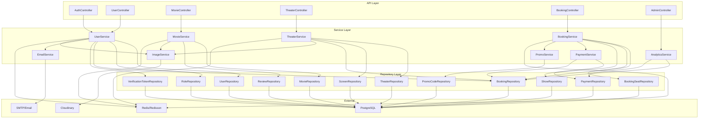

**Explanation:**

- The flowchart above shows the main layers and their interactions, including controllers, services, repositories, and external dependencies (Redis, Cloudinary, SMTP, PostgreSQL).
- Each controller delegates to one or more services, which in turn use repositories and external services.

---

## 13. Sequence Diagrams for Key Flows

### 13.1 User Registration & Email Verification

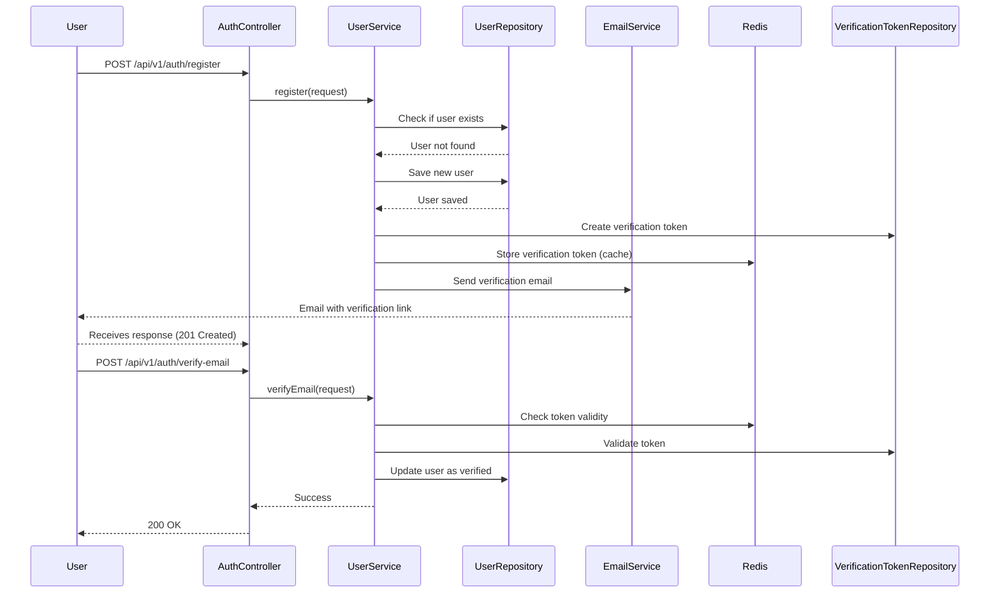

**Explanation:**

- This sequence diagram details the registration and email verification process, including token creation, caching, and email delivery.

### 13.2 Booking Flow (with Distributed Locking & Payment)

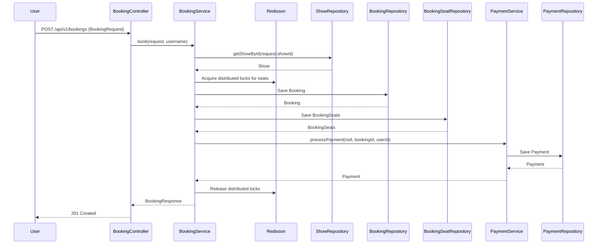

**Explanation:**

- This sequence diagram shows the booking process, including distributed seat locking, booking persistence, and payment processing.

---

## 14. Flowcharts for Major Modules

### 14.1 Booking Process Flowchart

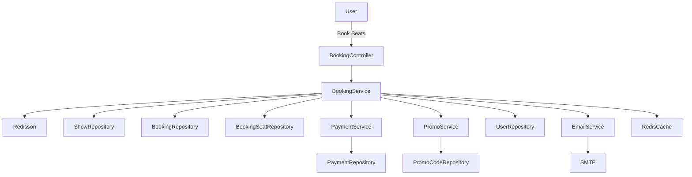

**Explanation:**

- This flowchart visualizes all the modules and dependencies involved in the booking process, from the API layer down to external services.

### 14.2 Authentication & Security Flowchart

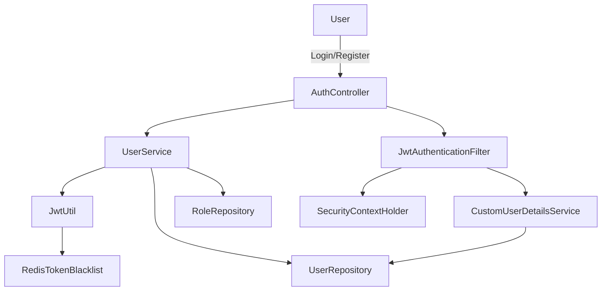

**Explanation:**

- This flowchart details the authentication and security flow, including JWT generation, token blacklisting, and user details resolution.

---

## 15. Granular Module Details

### 15.1 UserService

- Handles registration, login, email verification, password reset, profile management, and token blacklisting.
- Integrates with Redis for token caching and blacklisting.
- Sends emails via EmailService and uploads images via ImageService.
- Uses UserRepository, RoleRepository, BookingRepository, and VerificationTokenRepository.

### 15.2 BookingService

- Manages booking creation, modification, cancellation, and seat locking.
- Uses Redisson for distributed seat locks.
- Interacts with ShowRepository, BookingRepository, BookingSeatRepository, PaymentService, PromoService, and UserRepository.
- Ensures transactional consistency and prevents double-booking.

### 15.3 MovieService

- Handles CRUD for movies, poster uploads, and reviews.
- Integrates with ImageService for poster management.
- Uses MovieRepository, ReviewRepository, and ActorRepository.

### 15.4 TheaterService

- Manages theaters, screens, amenities, and logos.
- Uses TheaterRepository, ScreenRepository, BookingRepository, UserRepository, and ImageService.

### 15.5 PaymentService

- Processes payments for bookings.
- Uses PaymentRepository and BookingRepository.
- Can be extended for real payment gateway integration.

### 15.6 PromoService

- Manages promo codes, discount calculation, and usage tracking.
- Uses PromoCodeRepository.

### 15.7 AnalyticsService

- Provides booking and revenue analytics for admins and theater owners.
- Uses BookingRepository and PaymentRepository.

### 15.8 EmailService

- Sends verification and password reset emails using SMTP and Thymeleaf templates.
- Handles async email delivery.

### 15.9 ImageService

- Uploads and deletes images via Cloudinary.
- Used for user profiles, movie posters, and theater logos.

---

## 16. Extending & Customizing the Backend

- Add new features by creating new controllers, services, and repositories following the existing layered pattern.
- Integrate new external services (e.g., payment gateways) by extending the relevant service and updating the configuration.
- Use the provided diagrams to understand and trace data and control flow for debugging or extension.

---

_For further diagrams, such as admin analytics or review flows, or for even more granular breakdowns, please specify the area of interest._

---

## 17. Detailed Workflow Sequence Diagrams

### 17.1 Login Workflow

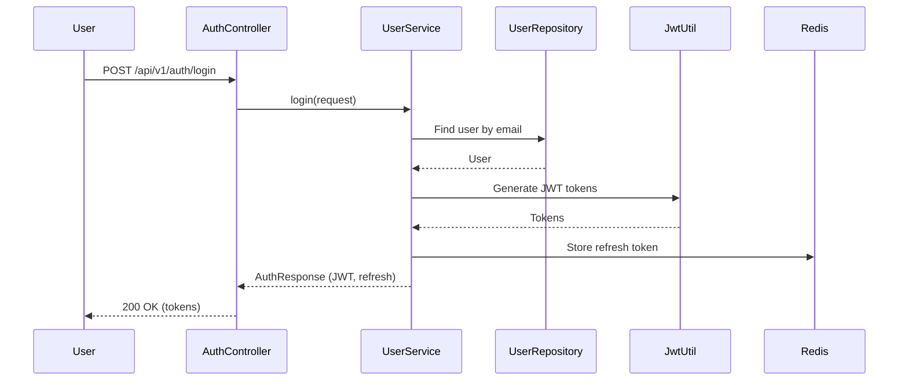

**Explanation:**

- User submits login credentials. The system authenticates, generates JWT tokens, stores the refresh token in Redis, and returns tokens to the user.

### 17.2 Signup Workflow

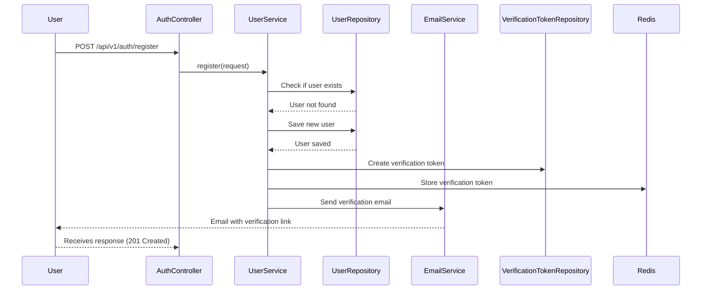

**Explanation:**

- User registers, system checks for existing user, saves new user, creates a verification token, stores it in Redis, and sends a verification email.

### 17.3 Admin Analytics Workflow

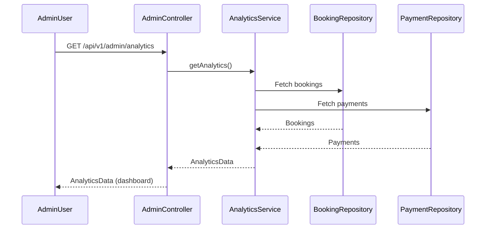

**Explanation:**

- Admin requests analytics, which are aggregated from bookings and payments and returned for dashboard display.

### 17.4 Add Theater Workflow (Theater Owner)

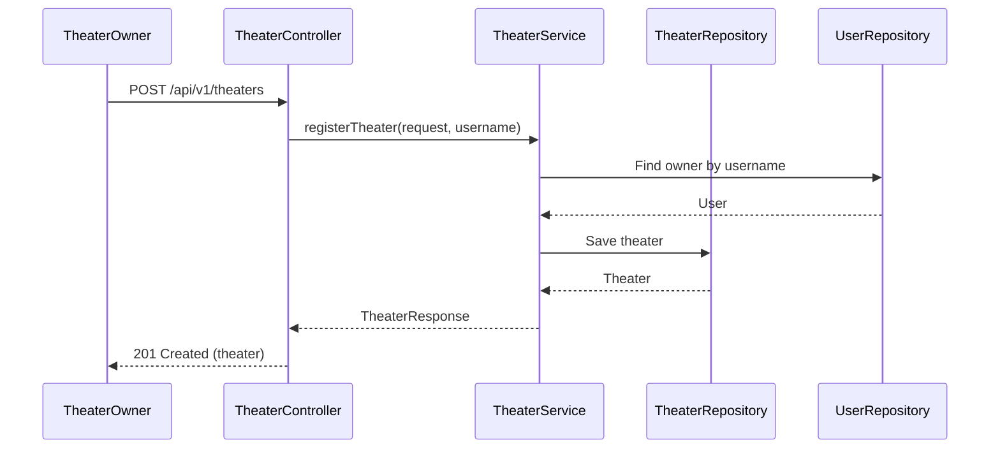

**Explanation:**

- Theater owner registers a new theater, which is saved and linked to their user account.

### 17.5 Add Movie Workflow (Theater Owner/Admin)

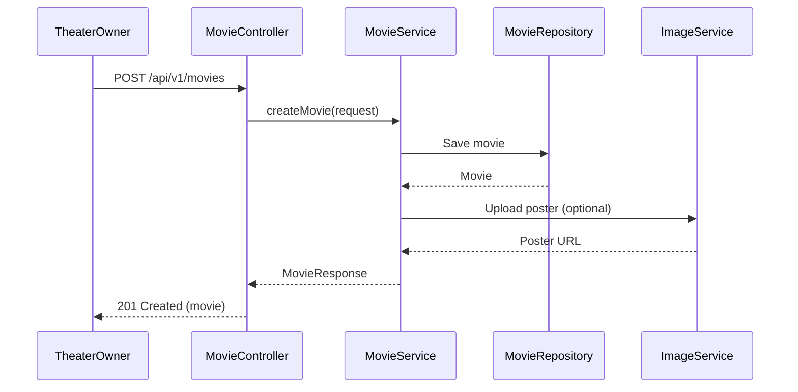

**Explanation:**

- Owner or admin adds a movie, optionally uploads a poster, and receives a confirmation response.

### 17.6 Book Ticket Workflow


**Explanation:**

- User books a ticket, seats are locked, booking and payment are processed, and a response is returned.

### 17.7 Change Booking Workflow

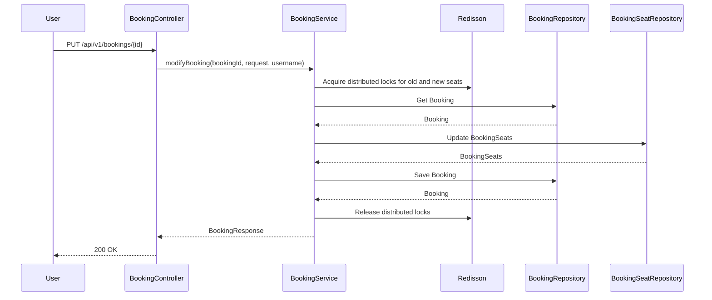

**Explanation:**

- User modifies a booking, system locks both old and new seats, updates booking, and releases locks.

### 17.8 Make Payment Workflow

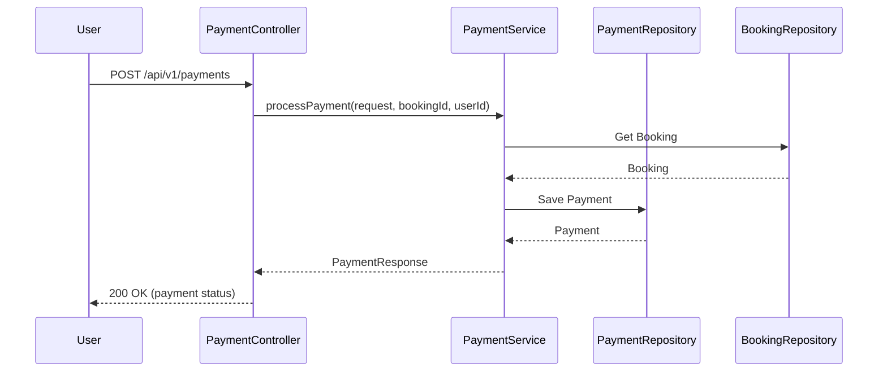

**Explanation:**

- User initiates payment, which is processed and saved, and the payment status is returned.

---

_For additional workflows (e.g., password reset, review submission, seat locking, etc.), or for user-specific flows (admin, theater owner, regular user), please specify further details or scenarios of interest._

---

## 19. Class Diagram (Domain Model)

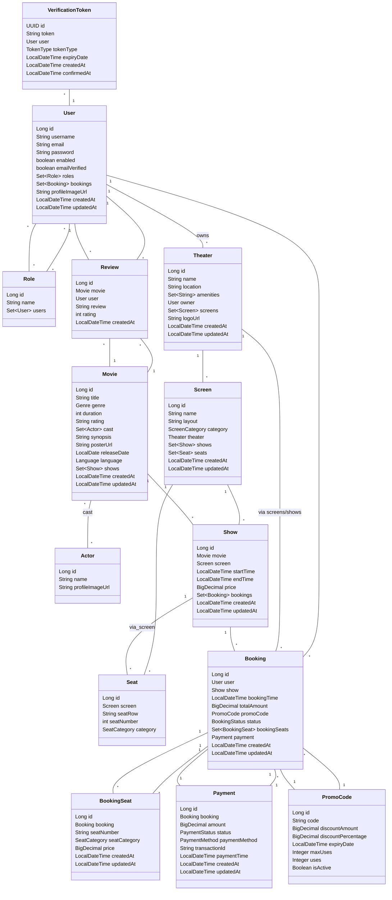

## 20. Database ER Diagram

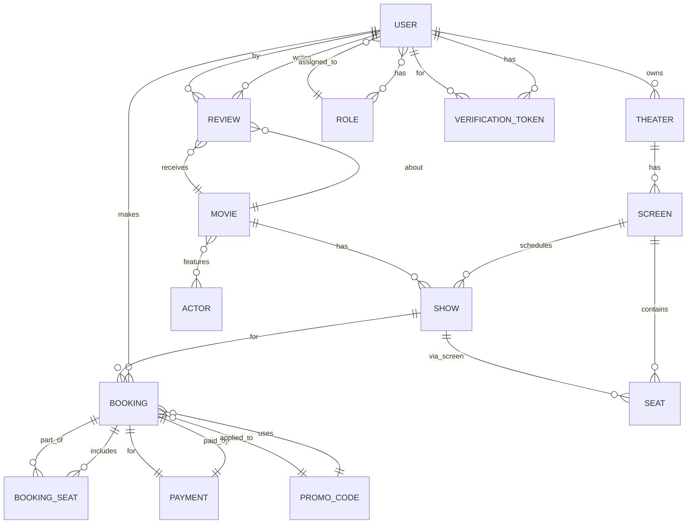

## 21. Controller Logic Breakdown

### AuthController

- **POST /register:** Register a new user, send verification email.
- **POST /login:** Authenticate user, return JWT tokens.
- **POST /verify-email:** Verify user email with code.
- **POST /password-reset/initiate:** Send password reset email.
- **POST /password-reset/complete:** Reset password using token.
- **POST /change-password:** Change user password (authenticated).
- **POST /logout:** Logout user, blacklist token.

### UserController

- **POST /profile/image:** Upload profile image for current user.
- **PUT /profile:** Update profile information for current user.

### MovieController

- **POST /**: Create a new movie (admin).
- **PATCH /{movieId}:** Update movie details (admin).
- **DELETE /{movieId}:** Delete a movie (admin).
- **GET /{movieId}:** Get movie details.
- **GET /**: Search/filter movies with pagination.
- **POST /{movieId}/poster:** Upload movie poster (admin).
- **POST /{movieId}/review:** Add a review to a movie (user/admin).
- **GET /{movieId}/reviews:** Get reviews for a movie.

### TheaterController

- **POST /**: Register a new theater (owner).
- **PATCH /{theaterId}:** Update theater details (owner).
- **DELETE /{theaterId}:** Delete a theater (owner).
- **GET /{theaterId}:** Get theater details.
- **GET /owner/me:** Get all theaters owned by current user.
- **POST /{theaterId}/screens:** Add a screen to a theater (owner).
- **PUT /screens/{screenId}:** Update a screen (owner).
- **DELETE /screens/{screenId}:** Delete a screen (owner).
- **GET /{theaterId}/screens:** Get all screens for a theater.
- **PATCH /{theaterId}/amenities:** Update theater amenities (owner).
- **GET /**: List theaters with pagination.
- **GET /owner/analytics/bookings:** Get bookings analytics for owner.
- **GET /owner/analytics/revenue:** Get revenue analytics for owner.
- **POST /{theaterId}/logo:** Upload theater logo.

### BookingController

- **POST /**: Book seats for a show.
- **POST /lock-seats:** Lock seats for a show before booking.
- **PUT /{bookingId}:** Modify an existing booking.
- **DELETE /{bookingId}:** Cancel a booking.
- **POST /group:** Group booking (multiple bookings at once).
- **GET /{bookingId}:** Get booking details.
- **GET /user:** Get all bookings for current user.
- **GET /shows/{showId}/unavailable-seats:** Get unavailable seats for a show.

### AdminController

- **GET /dashboard:** Admin dashboard (placeholder).
- **GET /analytics/bookings:** Get bookings analytics.
- **GET /analytics/revenue:** Get revenue analytics.
- **GET /analytics/users:** Get user growth analytics.

### HealthController

- **GET /health:** System health check.

## 22. Service Logic Breakdown

### UserService

- **register:** Register user, save to DB, send verification email.
- **login:** Authenticate, generate tokens, store refresh token in Redis.
- **sendEmailVerificationMail:** Send verification email with token.
- **verifyEmail:** Validate token, mark user as verified.
- **sendPasswordResetMail:** Send password reset email with token.
- **resetPassword:** Validate token, update user password.
- **getProfile:** Fetch user profile.
- **getBookingHistory:** Fetch user's booking history.
- **updateProfile:** Update user profile fields.
- **findByUsername:** Find user by username.
- **save:** Save user entity.
- **logout:** Blacklist token, remove refresh token from Redis.
- **isTokenBlacklisted:** Check if token is blacklisted.
- **changePassword:** Change user password.
- **uploadProfileImage:** Upload image to Cloudinary, update user profile.

### MovieService

- **createMovie:** Validate and save new movie.
- **updateMovie:** Update movie details.
- **deleteMovie:** Delete movie by ID.
- **getMovie:** Get movie details.
- **searchMovies:** Search/filter movies with pagination.
- **uploadPoster:** Upload poster to Cloudinary, update movie.
- **addReview:** Add review for a movie.
- **getReviews:** Get reviews for a movie.
- **getMovieById:** Fetch movie entity.
- **save:** Save movie entity.

### TheaterService

- **registerTheater:** Register new theater, link to owner.
- **updateTheater:** Update theater details.
- **deleteTheater:** Delete theater by ID.
- **getTheater:** Get theater details.
- **getTheatersByOwner:** Get all theaters for owner.
- **addScreen:** Add screen to theater.
- **updateScreen:** Update screen details.
- **deleteScreen:** Delete screen by ID.
- **getScreensByTheater:** Get all screens for a theater.
- **updateAmenities:** Update theater amenities.
- **listTheaters:** List theaters with filters/pagination.
- **getOwnerBookingsAnalytics:** Get bookings analytics for owner.
- **getOwnerRevenueAnalytics:** Get revenue analytics for owner.
- **getTheaterById:** Fetch theater entity.
- **save:** Save theater entity.
- **uploadLogo:** Upload logo to Cloudinary, update theater.

### BookingService

- **book:** Book seats, lock seats, save booking, process payment.
- **lockSeats:** Lock seats for a show.
- **modifyBooking:** Modify booking, lock old/new seats, update booking.
- **cancelBooking:** Cancel booking, update status.
- **groupBooking:** Book multiple bookings at once.
- **getBooking:** Get booking details.
- **getBookingsByUser:** Get all bookings for user.
- **getUnavailableSeats:** Get unavailable seats for a show.

### PaymentService

- **processPayment:** Process payment for booking, save payment entity.
- **refundPayment:** Refund payment (not detailed above).
- **getPaymentStatus:** Get payment status for a booking.
- **getPaymentHistory:** Get payment history for user.

### PromoService

- **validatePromoCode:** Validate promo code, return discount.
- **getPromoCodeById:** Fetch promo code entity.
- **calculateDiscount:** Calculate discount for booking.

### AnalyticsService

- **getBookingsAnalytics:** Get bookings analytics (by month).
- **getRevenueAnalytics:** Get revenue analytics (by month).
- **getUsersAnalytics:** Get user growth analytics (by month).

### EmailService

- **sendVerificationEmail:** Send verification email (async).
- **sendPasswordResetEmail:** Send password reset email (async).

### ImageService

- **uploadImage:** Upload image to Cloudinary.
- **deleteImage:** Delete image from Cloudinary.

---

_For even more detail (e.g., method-by-method code walkthroughs, or sequence diagrams for specific controller/service methods), please specify the area of interest._
